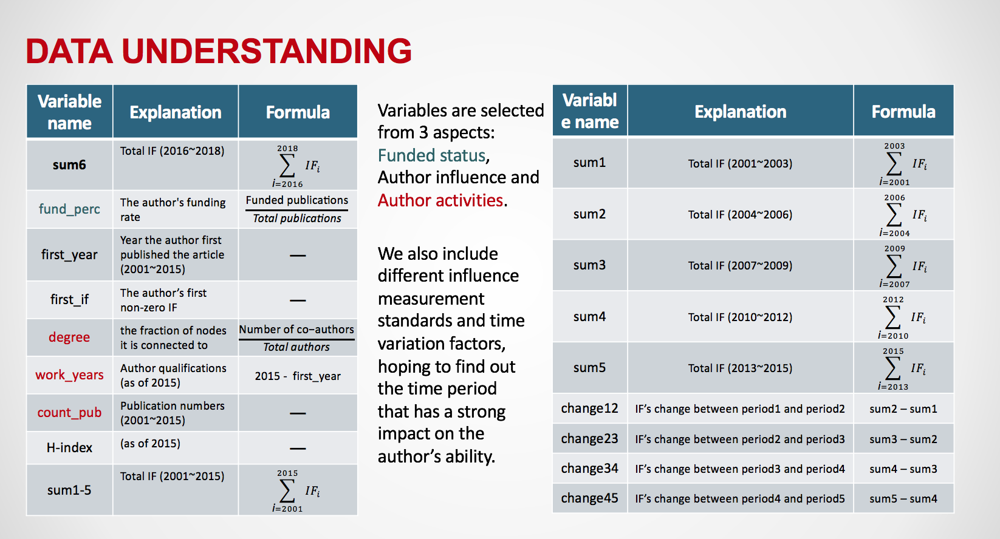

# Authors Analysis

**The main purpose of this project is to find most prominent authors in the field of depression treatment for funders using bibliography and data analysis.

- Scraping data from Web of Science
- Pre-processing 3800+ publication information from 2001 to 2018 on the field of depression treatment involving article title, published year, journals, authors, impact factor of  journals,  h-index, funding status
- Using social network analysis methodology to build co-author network and calculate centrality degree of every author
- Predicting the authors future performance based on impact factors

